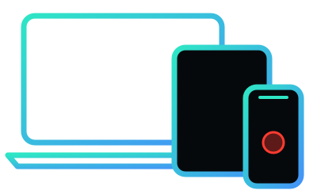
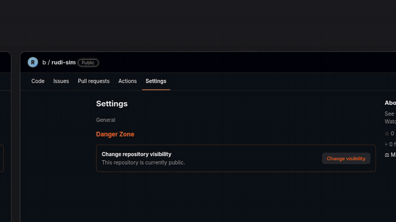

<p align="center"></p>

<h1 align="center">Rudi-Sim</h1>

<p align="center">See your website the way Safari draws it on any Apple screen, and watch Claude tap through it.<br>A skill for <a href="https://claude.com/claude-code">Claude Code</a>.</p>

<p align="center"></p>

## What it does

- **Watch mode.** A Safari window opens on your screen showing your site on the device you asked for, and Claude taps through it while you watch. A red dot shows each tap and a caption says what's happening. It saves a video and screenshots.
- **Several screens at once.** Ask for more than one device and they all show side by side in one window, shrunk to fit but keeping their real proportions. Tick screens on and off from the **Screens** checklist at the top of the window, which is there even when you start with one. Every tap happens on all of them together. Turn any screen 90° with the ⟳ button under it, or see one screen at its actual size with ⤢ (press it again to bring the others back), and iPhones show their notch or Dynamic Island with the space Safari leaves around it (switch that off in the checklist).
- **Before and after, live.** Run your current site and your changes at two addresses, and every screen shows twice: **Before** next to **After**, on the same device size. Each tap, scroll and page change happens on both, so you can check a fix before you merge it. It works when one site is `https` and the other `http`, tells you exactly which screen didn't load and why, and can reload just that one. Rudi-Sim can even start both versions of your project for you ([how](docs/PREVIEWS.md)).
- **39 Apple devices, or any size.** iPhone SE to iPhone 18 Pro Max and the foldable iPhone Duo, every current iPad, MacBooks and the iMac. Or ask for any size, like `390x844` or `1280x800`, including from the Screens checklist.
- **Check mode.** Claude takes light and dark screenshots on many devices at once and tells you what looks broken: sideways scrolling, JavaScript errors, missing pages and anything it sees in the screenshots.

It uses WebKit, the engine inside Safari, through [Playwright](https://playwright.dev), with each device's real screen size. Check mode and single-device windows also match each device's pixel density, touch and Safari identity. It isn't Apple's iOS Simulator (that needs a Mac with Xcode), so it can't show iOS-only things like the on-screen keyboard. It runs on Windows, Mac and Linux.

## Why use it

- **Check before you ship.** "Check localhost:3000 on all iPhones" gives you light and dark screenshots of every iPhone in Safari's engine.
- **Watch a whole flow.** Claude taps through sign-up or checkout on an iPhone SE, then switches to an iPad and stays signed in.
- **See a customer's bug.** "A user says the menu is broken on iPhone 13 mini. Show me." opens that exact screen, even if you build on Windows.
- **Compare screens side by side.** Phone, tablet and desktop in one window, at their real proportions.
- **Check a fix before you merge.** "Show localhost:5000 and my branch on localhost:5001 side by side on iPhone SE and iPad mini" puts Before and After next to each other, and Claude walks through both at once.
- **Find problems for you.** Sideways scrolling and JavaScript errors are listed for each device in plain words.
- **Get demo videos for free.** Every walkthrough saves a video with a dot for each tap and a caption for each step.
- **Try any size.** Small laptops, odd tablets or a half-width browser window, for example `390x844`.
- **Replay a saved tour.** Save a walkthrough once and replay it after every update. Each step says OK or FAILED.

## Install

You need [Claude Code](https://claude.com/claude-code) and [Node.js](https://nodejs.org) 20 or newer (the "LTS" installer is fine).

**As a plugin (easiest).** In Claude Code, run:

```
/plugin marketplace add f-loor/rudi-sim
/plugin install rudi-sim@rudi-sim
```

**Or by hand.** Download this repo (green **Code** button, then **Download ZIP**), unzip it, and copy the `skills/rudi-sim` folder into your skills folder:

- Windows: `C:\Users\<you>\.claude\skills\rudi-sim\`
- Mac and Linux: `~/.claude/skills/rudi-sim/`

so that `SKILL.md` sits directly inside `rudi-sim`. Restart Claude Code.

The first time you use it, Claude downloads Safari's engine (about 300 MB, a few minutes) into a `.rudi-sim` folder in your home folder.

## Things to ask

- "Walk me through my site at localhost:3000 on an iPad mini"
- "Show my homepage on iPhone SE, iPhone 16 Pro Max, iPad mini and iMac side by side"
- "Sign up on my site on an iPhone SE in dark mode, then switch to an iMac"
- "Check example.com on all iPads"
- "Show my site at 1280x800"
- "Show my site on the iPhone Duo, folded and open"
- "Compare localhost:5000 with localhost:5001 on iPhone 17 Pro and iPhone Duo (open), in landscape"
- "Play the example tour"
- "What devices can you simulate?"

You can also type `/rudi-sim` (or `/rudi-sim:rudi-sim` for the plugin) followed by what you want.

Videos and screenshots are saved in a `rudi-sim` folder inside whatever folder Claude Code is open in, one folder per session named after the site and time (like `localhost-3000_2026-10-06_14-30-05`). Set `RUDI_SIM_RECORDINGS` to keep them all in one place instead. The videos are `.webm` files and play in Chrome, Edge or Firefox.

## The Rudi-Sim app (Windows and Mac)

There's also a [Rudi-Sim app](docs/DESKTOP.md) for Windows and Mac. It needs no Node.js, has a setup guide, keeps all your recordings in one place where you can play, rename, export and delete them, and lets Claude Code and ChatGPT use the same simulator.

## Using it with ChatGPT

The ChatGPT plugin works with public websites straight away. To have ChatGPT show sites running on **your own computer**, in a window on your screen, use the [Rudi-Sim app](docs/DESKTOP.md) with an OpenAI tunnel. Setting up the tunnel is a developer task for now.

## More guides

- [How Rudi-Sim is put together](docs/ARCHITECTURE.md): one Rudi-Sim, with a door for Claude and one for ChatGPT.
- [Comparing before and after a change](docs/PREVIEWS.md)
- [The Rudi-Sim app for Windows and Mac](docs/DESKTOP.md), including ChatGPT
- [Getting it ready to share](docs/RELEASE.md)

## Running the scripts yourself

Everything lives in `skills/rudi-sim/scripts/`:

```
node setup.mjs                                     # one-time download
node check.mjs --list                              # all devices
node check.mjs example.com --device "iPhone SE, ipads" --themes light,dark
node walk.mjs start example.com --device "iPhone 16, iPad mini, iMac"
node walk.mjs do look                              # what's on screen
node walk.mjs do click "Sign up"
node walk.mjs do device 390x844
node walk.mjs stop
node walk.mjs tour example                         # play a saved tour
```

Saved tours are JSON files in `scripts/tours/`. See `example.json`.

## Good to know

- Screens in the watch window (even just one) are frames inside one Safari window. Each has the device's real width and height (less the space Safari keeps clear of the notch or Dynamic Island, unless you switch that off), so layouts and breakpoints are right, but they share the window's pixel density and the Mac version of Safari's identity. For exact per-device rendering, ask for one device "on its own" (a single device-sized window) or use check mode.
- If a button exists on only some screens (a phone menu, say), the step tells you which screens it wasn't found on.
- `--theme dark` only changes sites that follow the device's light or dark setting.
- Mac sizes are the whole screen at Apple's default scaling. A real Safari window is a little smaller.

## If something goes wrong

- **"claude is not recognized" on Windows right after installing**: open a new PowerShell window. If it still fails, the installer's note says its folder isn't on your PATH; add `C:\Users\<you>\.local\bin` to your user PATH and open a new window.
- **"node is not recognized"**: Node.js isn't installed, or Claude Code was open before you installed it. Close it, open it again, and retry.
- **Claude doesn't know the skill**: check that `SKILL.md` is directly inside `.claude/skills/rudi-sim/`, not in an extra folder level, then restart Claude Code.
- **The download of Safari's engine fails**: a work network or antivirus may be blocking it. Try another network.
- **One side of a Before/After comparison is blank or says it didn't load**: the message names the screen and the reason (for example, nothing is running at that address). Start that site, then ask Claude to `retry`; only the screens that failed are reloaded.
- **"PARTIAL" after a step**: the step worked on some screens but not all, usually because a button only exists on some of them (like a phone menu). The message lists which screens it missed.
- **A click you make yourself only happens in one screen**: that's expected. Steps Claude takes happen on every screen together; your own clicks and typing stay in the screen you used.
- **Demo data differs between Before and After**: if your site makes up random data in the browser with `Math.random()`, start with `--seed 42` so both sides get the same numbers. It only affects `Math.random()`; clocks, animations and data from a server still differ.
- **Linux says WebKit is missing libraries**: run `npx --prefix ~/.rudi-sim playwright install-deps webkit`.
- **To remove it**: delete the `rudi-sim` skills folder (or `/plugin uninstall rudi-sim`) and the `.rudi-sim` folder in your home folder.

## Tests

`node test/compare.mjs` checks Before/After loading (https next to http both ways, a site that isn't running, a slow page, recordings and `--seed`). `node test/preview.mjs` checks starting and stopping previews. `node test/run.mjs` runs about 75 checks against a small local test site, covering every device, forms, menus, redirects, sign-in, new tabs, errors, missing pages, slow and very long pages, custom sizes, the Screens checklist and the side-by-side window. GitHub runs it in real WebKit on Mac, Windows and Linux on every push.

## License

[MIT](LICENSE)
